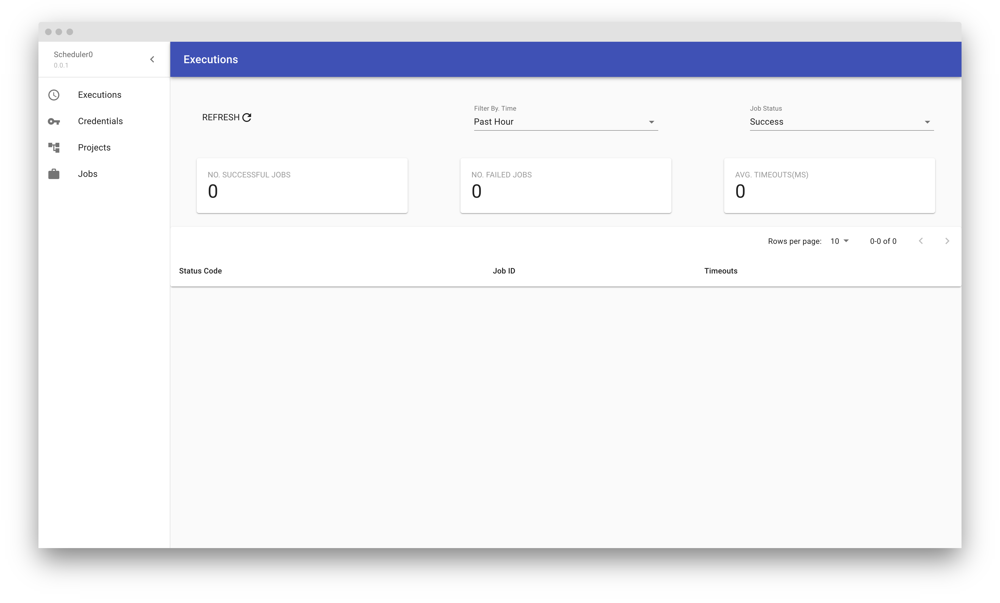

# Scheduler0

A simple scheduling server for apps and backend server.

[](https://goreportcard.com/report/github.com/victorlenerd/scheduler0) 
[](https://circleci.com/gh/victorlenerd/scheduler0/tree/master)

## Introduction

To use this you must first clone the repository and add the scheduler0 binary at the root of repo to your $PATH
    
The scheduler0 CLI tool in the root of this repo can be used to configure and start the server.
Postgres is needed to start the server, therefore after cloning the repo you need to run the config command.
```shell
scheduler0 config init
```

Will take you through the configuration flow, where you will be prompted to enter your database credentials.

### To start the http server.

```shell
scheduler0 start
```

For more information. Use the help flag
```shell
scheduler0 --help
```

## Configurations

Replace the secret key with your AES-256 key. It will be used to generate API Key and Secret Key.
As well as the other configurations.

```shell
Secret: AB551DED82B93DC8035D624A625920E2121367C7538C02277D2D4DB3C0BFFE94
PostgresDatabase: scheduler0_test
PostgresPassword: localdev
PostgresUser: core
PostgresHost: localhost:5432
Port: 9090
MaxMemory: 500mb
MaxCPU: 50
```

These configurations can set in the environment or `config.yml` in the root or by executing:

```shell
scheduler0 config init
```

## Credentials

Credentials are basically api keys and secrets needed for client apps to reach the scheduler0 server. 
Use command to generate credentials and more.

```shell
scheduler0 create credential --client server
```

The above command will create a credential for server, this includes api key and secret used in the node example app below.
You can use the list command to view all credentials, projects and jobs.

```shell
scheduler0 list -t credentials
```

## API Documentation

Assuming the scheduler0 server is running on `http://localhost:9090` there is a REST API documentation on http://localhost:9090/api-docs/ [](http://localhost:9090/api-docs/)

Note: that port 9090 is the default port for the server.

## Example Usage In Node Server

```javascript
'use strict'

require('dotenv').config()

const axios = require('axios')
const express = require('express')

const app = express()
const port = 3000

// Scheduler0 environment variables
const scheduler0Endpoint = process.env.API_ENDPOINT
const scheduler0ApiKey = process.env.API_KEY
const scheduler0ApiSecret = process.env.API_SECRET

const axiosInstance = axios.create({
    baseURL: scheduler0Endpoint,
    headers: {
        'x-api-key': scheduler0ApiKey,
        'x-secret-key': scheduler0ApiSecret
    }
});

async function createProject() {
    const { data: { data } } = await axiosInstance
        .post('/projects', {
            name: "sample project",
            description: "my calendar project"
        });
    return data
}

async function createJob(projectUUID) {
    try {
        const { data: { data } } = await axiosInstance
            .post('/jobs', {
                name: "sample project",
                spec: "@every 1m",
                project_uuid: projectUUID,
                callback_url: "http://localhost:3000/callback"
            });

        console.log(data)

        return data
    } catch (err) {
        console.log({ error: err.response.data })
    }
}

// This callback will get executed every minute
app.post('/callback', (req, res) => {
    res.send(`Callback executed at :${(new Date()).toUTCString()}`)
})

app.listen(port, async () => {
    const project = await createProject()
    const job  = await createJob(project.uuid)
   
    console.log(`app listening at http://localhost:${port}`)
})

```


## [WIP]: Dashboard

The dashboard is supposed to be a GUI for managing projects, credentials and jobs.


 
# License

 * MIT license ([LICENSE-MIT](LICENSE-MIT) or
   http://opensource.org/licenses/MIT)

at your option.

### Contribution

Unless you explicitly state otherwise, any contribution intentionally submitted
for inclusion in this project by you, as defined in the Apache-2.0 license,
shall be dual licensed as above, without any additional terms or conditions.
